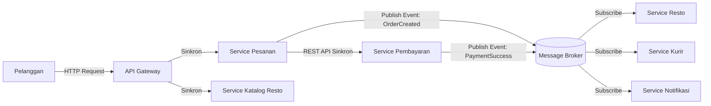
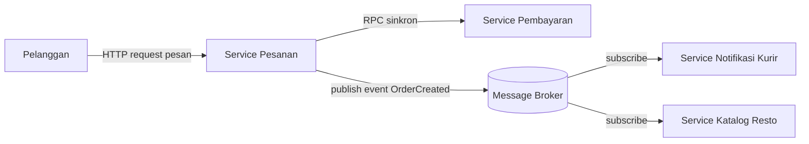

# Tugas 2 (Pekan 2) — Perancangan Arsitektur untuk FoodGo

**Materi terkait:** Architectural style (Layered, SOA, Peer-to-Peer, Publish-Subscribe).

## Studi Kasus

Melanjutkan Tugas 1: FoodGo butuh sistem yang **decoupled** agar tim kurir dan tim resto tidak saling mengganggu ketika salah satu modul diperbarui/deploy ulang. Saat ini semua modul (pesanan, pembayaran, notifikasi kurir, katalog resto) berjalan sebagai satu aplikasi monolitik — sekali deploy, semua modul ikut restart dan berisiko downtime total.

## Tugas Kelompok

1. Pilih **satu** gaya arsitektur utama: **Service-Oriented Architecture (SOA)** atau **Publish-Subscribe**. Boleh dikombinasikan (mis. SOA untuk service inti + Pub-Sub untuk notifikasi), tapi harus dijustifikasi kenapa kombinasi ini yang dipilih.
2. Gambarkan minimal 4 komponen berikut dan interaksinya: modul Pesanan, modul Pembayaran, modul Kurir/Notifikasi, modul Katalog Resto (dan message broker/API gateway jika relevan).
3. Jelaskan alur satu skenario penuh secara end-to-end di diagram (misalnya: pelanggan buat pesanan → bayar → resto terima notifikasi → kurir ditugaskan) — tunjukkan komponen mana berkomunikasi dengan siapa, dan **jenis komunikasinya** (sinkron/asinkron, request-response/event).
4. Analisis tertulis: kenapa gaya ini mengatasi masalah *coupling* dari Tugas 1, dan apa trade-off-nya (mis. Pub-Sub menambah kompleksitas debugging karena alur tidak linear).


JAWABAN:

Pemilihan gaya arsitektur utama:
Berdasarkan hasil analisis pada Tugas 1, FoodGo mengalami beberapa masalah utama yaitu **Single Point of Failure**, asumsi bahwa **The Network is Reliable**, dan **The Latency is Zero**. Masalah tersebut muncul karena seluruh modul masih berada dalam satu aplikasi monolitik sehingga semua fungsi saling bergantung. Oleh karena itu, FoodGo menggabungkan 2 kombinasi yaitu **Service-Oriented Architecture (SOA)** sebagai arsitektur utama dengan **Publish-Subscribe** sebagai mekanisme komunikasi untuk notifikasi.
   
   ### a. Service-Oriented Architecture (SOA)

SOA digunakan untuk memisahkan fungsi utama FoodGo menjadi beberapa service yang berdiri sendiri.
Service utama terdiri dari:
- Service Pesanan
- Service Pembayaran
- Service Katalog Resto
- Service Kurir/Notifikasi
Komunikasi utama antar-service menggunakan **REST API** melalui **API Gateway** secara **sinkron (request-response)** untuk proses yang membutuhkan jawaban langsung, seperti pembayaran.

 ### b. Publish-Subscribe
Setelah suatu proses penting selesai (misalnya pesanan berhasil dibuat atau pembayaran berhasil), service akan mengirimkan **event** ke **Message Broker**.
Event tersebut dapat diterima oleh:
- Service Kurir
- Service Katalog Resto
- Service Notifikasi
Komunikasi ini bersifat **asinkron**, sehingga service tidak perlu saling menunggu.
### Alasan Pemilihan
Kombinasi ini dipilih karena sesuai dengan masalah pada Tugas 1.
- Menghilangkan ketergantungan pada satu aplikasi monolitik.
- Mengurangi risiko seluruh sistem berhenti ketika satu modul bermasalah.
- Memungkinkan setiap service di-deploy secara terpisah.
- Mengurangi beban komunikasi langsung melalui mekanisme event.
---
## 2. Diagram Arsitektur


### Komponen

1. **API Gateway**
   - Pintu masuk seluruh request dari pelanggan.
   - Meneruskan request ke service terkait.

2. **Service Pesanan**
   - Membuat dan mengelola pesanan.
   - Memanggil service pembayaran.

3. **Service Pembayaran**
   - Memproses transaksi pembayaran.
   - Mengirim event setelah pembayaran berhasil.

4. **Service Katalog Resto**
   - Menampilkan daftar restoran dan menu.

5. **Message Broker**
   - Menyalurkan event ke service lain.
   - Tidak memerlukan komunikasi langsung antar-service.

6. **Service Kurir**
   - Menerima event pembayaran berhasil.
   - Menugaskan kurir.

7. **Service Notifikasi**
   - Mengirim pemberitahuan kepada pelanggan.
---
## 3. Alur Skenario End-to-End

### Skenario: Pelanggan Memesan Makanan

| Langkah | Komunikasi |
|---|---|
| Pelanggan memilih menu | HTTP ke API Gateway |
| API Gateway meminta data menu | Sinkron ke Service Katalog |
| Pelanggan membuat pesanan | Sinkron ke Service Pesanan |
| Service Pesanan meminta pembayaran | Sinkron ke Service Pembayaran |
| Pembayaran berhasil | Event `PaymentSuccess` dipublish ke Message Broker |
| Service Resto menerima event | Asinkron |
| Service Kurir menerima event | Asinkron |
| Service Notifikasi mengirim pesan | Asinkron |

### Penjelasan Alur

1. Pelanggan mengakses aplikasi melalui **API Gateway**.
2. API Gateway mengambil informasi menu dari **Service Katalog Resto**.
3. Setelah pelanggan melakukan checkout, request dikirim ke **Service Pesanan**.
4. Service Pesanan meminta konfirmasi ke **Service Pembayaran** secara sinkron karena hasil pembayaran harus diketahui saat itu juga.
5. Ketika pembayaran berhasil, Service Pembayaran mengirim event **PaymentSuccess** ke **Message Broker**.
6. Service Resto menerima event tersebut untuk mulai menyiapkan makanan.
7. Service Kurir menerima event yang sama untuk mencari kurir yang tersedia.
8. Service Notifikasi mengirim informasi kepada pelanggan tanpa mengganggu proses service lainnya.

---


## Cara Membuat Diagram (Gratis, Cukup Laptop)

Tidak perlu software berbayar. Dua opsi:

**Opsi A — Mermaid di dalam Markdown (disarankan).** Ditulis sebagai teks biasa di `README.md`, otomatis dirender jadi diagram oleh GitHub — tidak perlu install apa pun.

````markdown

````

**Opsi B — draw.io / diagrams.net** (gratis, jalan di browser tanpa akun, atau app desktop offline di [app.diagrams.net](https://app.diagrams.net/)). Ekspor sebagai `.png` dan simpan di folder `diagram/`.

## Struktur Submission

```
tugas-02-perancangan-arsitektur/
├── README.md          # Analisis + diagram Mermaid (jika Opsi A) atau referensi ke diagram/
├── JURNAL.md
└── diagram/            # File .png/.drawio jika pakai Opsi B
```

## Rubrik Penilaian (Tugas 2)

| Komponen | Bobot | Kriteria |
|---|---|---|
| Ketepatan pemilihan gaya arsitektur | 20% | Justifikasi SOA/Pub-Sub sesuai kebutuhan *decoupling* di skenario |
| Kelengkapan & kejelasan diagram | 30% | Semua komponen kunci ada, jenis komunikasi (sinkron/asinkron) jelas ditandai |
| Analisis trade-off | 30% | Bukan hanya kelebihan — kekurangan/kompleksitas baru juga dibahas |
| Proses & kontribusi kelompok | 20% | `JURNAL.md`, commit history |

## Batasan Penggunaan AI (Level 2)

Kebijakan **Level 2 (AI Assisted Idea Generation & Structuring)** berlaku — lihat [`../RUBRIK-UMUM.md`](../RUBRIK-UMUM.md). Boleh memakai AI untuk brainstorming komponen apa saja yang umum ada di gaya arsitektur SOA/Pub-Sub; **tidak boleh** meminta AI menggambar diagram final atau menuliskan analisis trade-off yang tinggal ditempel. Catat pemakaian AI di "Log Penggunaan AI" pada `JURNAL.md`.

- Diagram Mermaid/draw.io yang "terlalu generik" (identik dengan contoh tutorial di internet tanpa penyesuaian ke kasus FoodGo) akan dinilai rendah pada komponen kelengkapan & kejelasan diagram.
